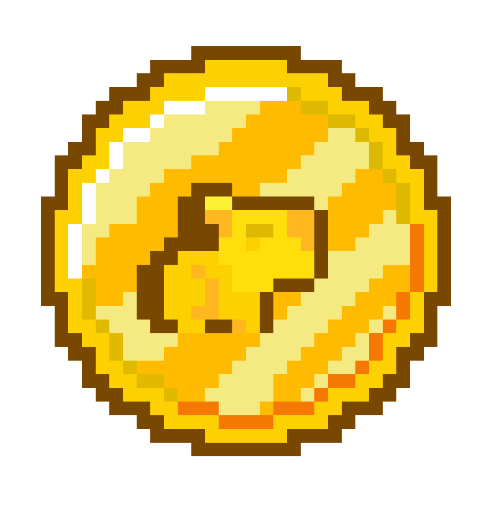
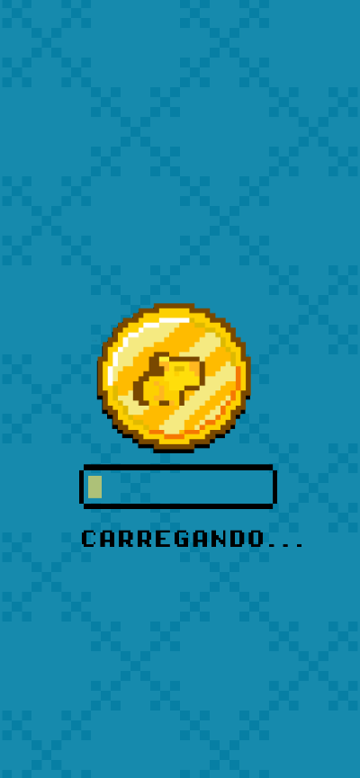
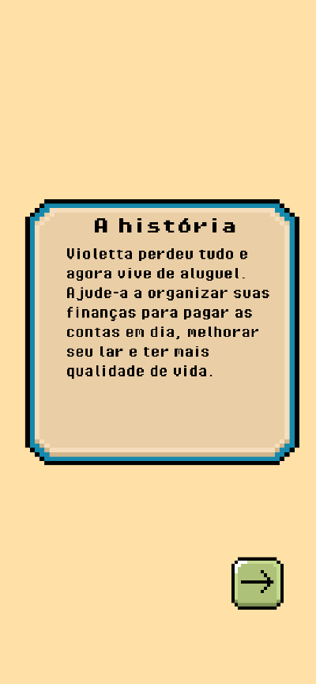
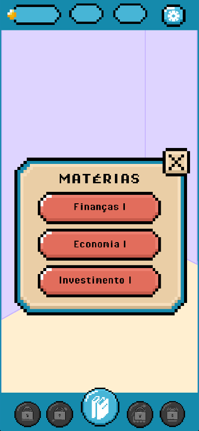
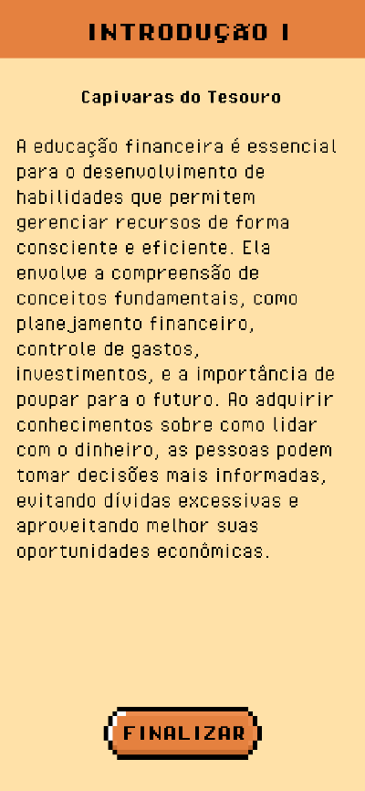
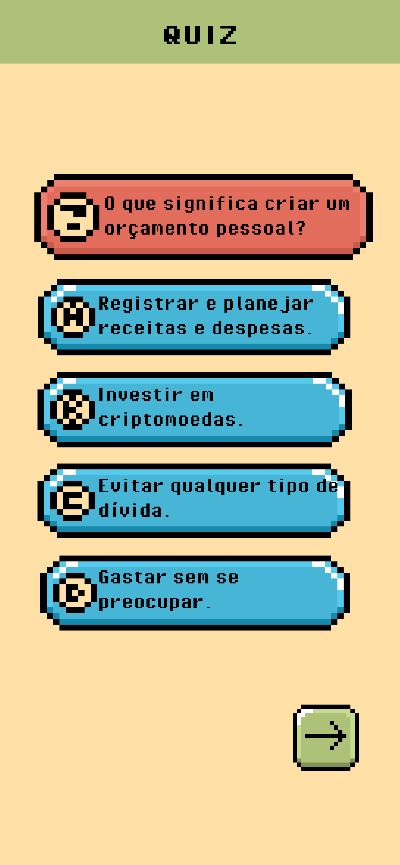
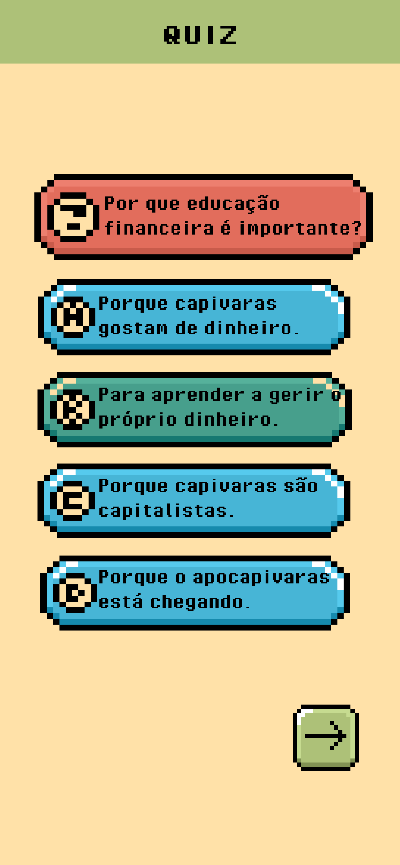
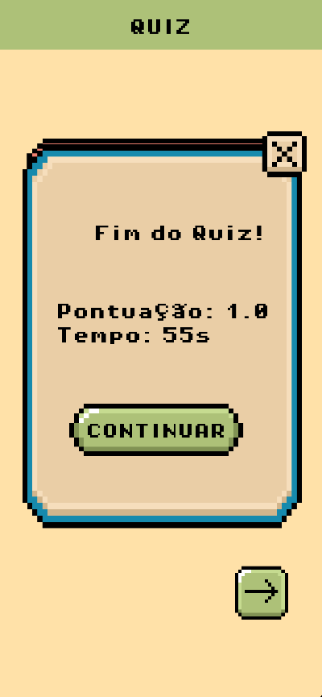

<!-- Usei este modelo como base de edição: https://github.com/othneildrew/Best-README-Template -->

<!--
*** Caso queira mudar qualquercoisa aqui, pode enviar seu 
*** commit alterando o que deseja :D
-->

[![Contributors][contributors-shield]][contributors-url]
[![Forks][forks-shield]][forks-url]
[![Stargazers][stars-shield]][stars-url]
[![Issues][issues-shield]][issues-url]
[![MIT License][license-shield]][license-url]
[![LinkedIn][linkedin-shield]][linkedin-url]

<!-- PROJECT LOGO -->
 

  
  
  <h2 align="center">Capy Ensina</h2>

  

    O Capy Ensina é um jogo de simualção onde você aplica conhecimentos financeiros na prática.
     
  

<!-- END: PROJECT LOGO -->

<!-- Tabela de resumo -->

  
Atividades

  <ol>
    <!-- Segundo: Descrição (com sublista) -->
    <li>
      <a href="#descrição-do-projeto">Descrição</a>
      <ul>
        <li><a href="#funcionalidades">Funcionalidades</a></li>
      </ul>
    </li>
    <!-- Primeiro: Sobre -->
    <li>
      <a href="#sobre-o-proa">Sobre o Proa</a>
    </li>
    <!-- Terceiro: Tecnologias Usadas -->
    <li>
      <a href="#tecnologias-utilizadas">Tecnologias Utilizadas</a>
    </li>
    <!-- Quinto: Capturas de tela -->
    <li>
      <a href="#capturas-de-tela">Capturas de tela</a>
    </li>
    <!-- Sexto: Capturas de tela -->
    <li>
      <a href="#equipe">Equipe</a>
    </li>
    <!-- Sétimo: Futuras Melhorias -->
    <li>
      <a href="#futuras-melhorias-e-roadmap">Futuras Melhorias</a>
    </li>
    <!-- Oitavo: Licença -->
    <li>
      <a href="#licença">Licença</a>
    </li>
  </ol>

<!-- END: Tabela de resumo -->

<!-- Descrição de projeto -->
## Descrição de projeto

Esse jogo foi desenvolvido como trabalho de conclusão de curso para o instituto proa.
O Capy Ensina é um jogo de simuação, nele você aprende e aplica métodos de planejamento 
financeiro, aprende sobre economia e investimentos.

<!-- SOBRE O PROA -->
## Sobre o Proa

O Instituto PROA nasceu em 2007 com o objetivo de capacitar e inserir jovens de baixa renda, vindos de escolas públicas, no mercado de trabalho. Por meio de desenvolvimento pessoal e profissional, o PROA já impactou mais de 70 mil jovens e hoje atua em 11 Estados: SP, RJ, MG, SC, RS, PR, PE, BA, GO, DF e MS com dois projetos: o PROPROFISSÃO e a Plataforma PROA.
 
<a href="https://www.proa.org.br">Instituto Proa</a>

(<a href="#readme-top">voltar ao topo</a>)

<!-- Funcionalidades -->
#### Funcionalidades

- **Textos Educativos** Dentro do menu de matérias, você terá as opções de Finanças, Economia e Investimentos;
- **Minigames** Sempre que terminar um texto educativo, você será direcionado para um minigame;
- **Configurações** É possível alterar opções de sons :D
 
<!-- END: Funcionalidades -->

(<a href="#readme-top">voltar ao topo</a>)

<!-- END: Descrição de projeto -->

<!-- Tecnologias -->
## Tecnologias Utilizadas

  

- Framework: LibKTX (fork da LibGDX para Kotlin)

(<a href="#readme-top">voltar ao topo</a>)

<!-- END: Tecnologias -->

<!-- Capturas de tela -->
## Capturas de tela

  
  
  
  
  
  
  

(<a href="#readme-top">voltar ao topo</a>)

<!-- END: Capturas de tela -->

## Equipe
- Francielly - Product Owner e Frontend   
- Malcoln - Scrum Master e Game Designer  
- Glenda - Backend e Análista de dados    
- Otavio - Frontend e Designer Gráfico    
- Miriã - Fullstack e UI Designer         
- Guilherme - Fullstack e Financeiro      
- Jonathan - Frontend e Social Media      

<!-- Futuras Melhorias -->
## Futuras Melhorias e Roadmap
### Médio Prazo

- [ ] Adição de novas matérias: Finanças I, II, III
- [ ] Adição de novas matérias: Economia I, II, III
- [ ] Adição de novas matérias: Investimentos I, II, III
- [ ] Mudança de cores
- [ ] Mudançã de fonte
- [ ] Customização de casa
- [ ] Customização de personagem
- [ ] Loja de itens para casa e personagem
- [ ] Mais Minigames!

### Longo Prazo

- [ ] Multiplayer
- [ ] Salvar progresso em nuvem
- [ ] Minigames em equipe
- [ ] Sistema de empresas (Guilda)
- [ ] Adição de novas matérias: Tributação Brasileira para cidadãos I, II, III
- [ ] Adição de novas matérias: Tributação Brasileira para empresas I, II, III

(<a href="#readme-top">voltar ao topo</a>)

<!-- END: Futuras Melhorias -->

<!-- LICENSE -->
## Licença

Distrubuído através da licença MIT.

(<a href="#readme-top">voltar ao topo</a>)

<!-- END: LICENSE -->

[contributors-shield]: https://img.shields.io/github/contributors/Capy-Ensina/game-app.svg?style=for-the-badge
[contributors-url]: https://github.com/Capy-Ensina/game-app/graphs/contributors
[forks-shield]: https://img.shields.io/github/forks/Capy-Ensina/game-app?style=for-the-badge
[forks-url]: https://github.com/Capy-Ensina/game-app/network/members
[stars-shield]: https://img.shields.io/github/stars/Capy-Ensina/game-app.svg?style=for-the-badge
[stars-url]: https://github.com/Capy-Ensina/game-app/stargazers
[issues-shield]: https://img.shields.io/github/issues/Capy-Ensina/game-app.svg?style=for-the-badge
[issues-url]: https://github.com/Capy-Ensina/game-app/issues
[license-shield]: https://img.shields.io/github/license/Capy-Ensina/game-app.svg?style=for-the-badge
[license-url]: https://github.com/Capy-Ensina/game-app/blob/master/LICENSE.txt
[linkedin-shield]: https://img.shields.io/badge/-LinkedIn-black.svg?style=for-the-badge&logo=linkedin&colorB=555
[linkedin-url]: https://www.linkedin.com/company/capy-ensina